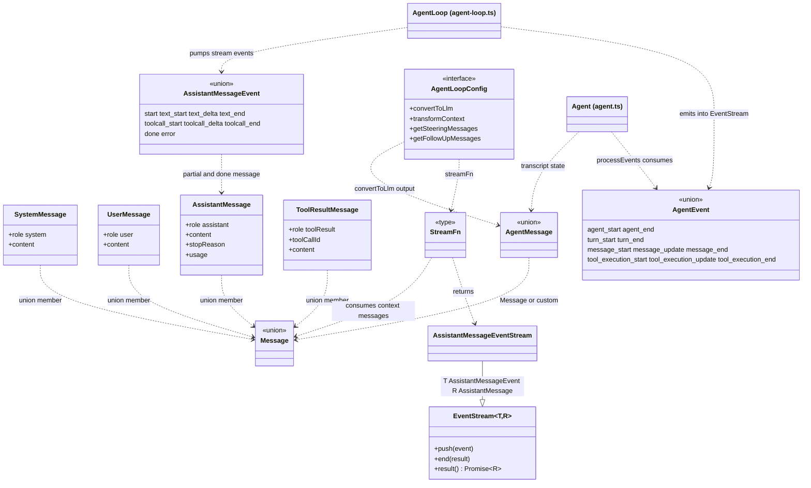
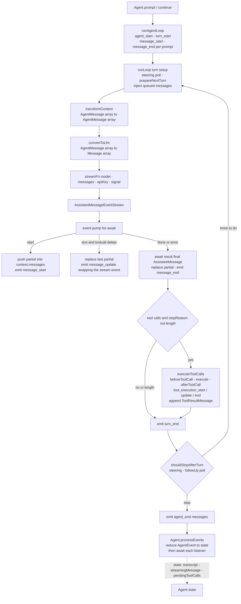
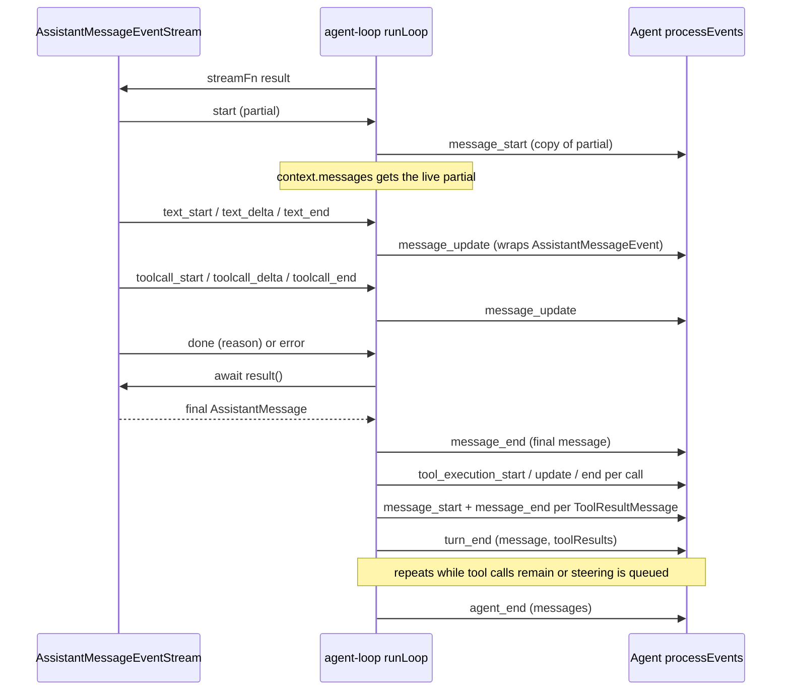

# Messages, events, streams — dependency and flow

The three families in `reduced/agent/src`:

- **Messages** (`types.ts`): the transcript. `Message` = system / user / assistant / toolResult; `AgentMessage` adds app-defined custom messages via declaration merging.
- **Events** (`types.ts`): two protocols. `AssistantMessageEvent` — deltas inside one assistant stream; `AgentEvent` — the 10-kind lifecycle the loop emits to the UI.
- **Streams** (`event-stream.ts`, `stream-fn.ts`, `types.ts`): `EventStream<T, R>` buffered async iteration; `AssistantMessageEventStream` completes on `done`/`error` and extracts the final `AssistantMessage`; `StreamFn` produces one per model request.

Arrows: `--|>` extends, `-->` holds/references, `..>` uses/produces.

## Type dependencies

Notes not expressible in the diagram:

- `Message` and `AgentMessage` are type unions, not classes. `AgentMessage = Message | CustomAgentMessages[keyof CustomAgentMessages]`.
- `EventStream<AgentEvent, AgentMessage[]>` is also the public return type of `agentLoop()` / `agentLoopContinue()` — the same stream class instantiated twice with different payloads.
- `AgentEvent.message_update` is the only event that carries an `AssistantMessageEvent`; it forwards every text/toolcall stream event verbatim.

## Runtime flow

One run from `Agent.prompt()` (or bare `runAgentLoop`) to `agent_end`. The stream carries `AssistantMessageEvent`s; the loop turns them into an `AssistantMessage` plus `AgentEvent`s; the wrapper reduces those into state and listener calls.

Exit conditions (all reach `agent_end`): no tool calls and no queued steering/follow-ups; `shouldStopAfterTurn` returns true; every tool result in the batch sets `terminate`; the stream settles with stopReason `error`/`aborted` (that assistant message becomes the final turn). A thrown run is converted by `Agent.handleRunFailure` into a synthetic error/aborted assistant message plus the full `message_start` -> `message_end` -> `turn_end` -> `agent_end` sequence.

## Event ordering in one turn

The interleaving of stream events, transcript mutation, and `AgentEvent`s:

- `message_start`/`message_update` carry shallow copies; only `message_end` appends the final message to `Agent` state (`processEvents`).
- Tool result messages are emitted after the whole batch finalizes (in assistant source order); `tool_execution_end` may arrive earlier, in completion order.
- There is exactly one `turn_start` per turn: emitted by `runAgentLoop` for the first turn, then by `runLoop` for every subsequent turn (after `prepareNextTurn`).
