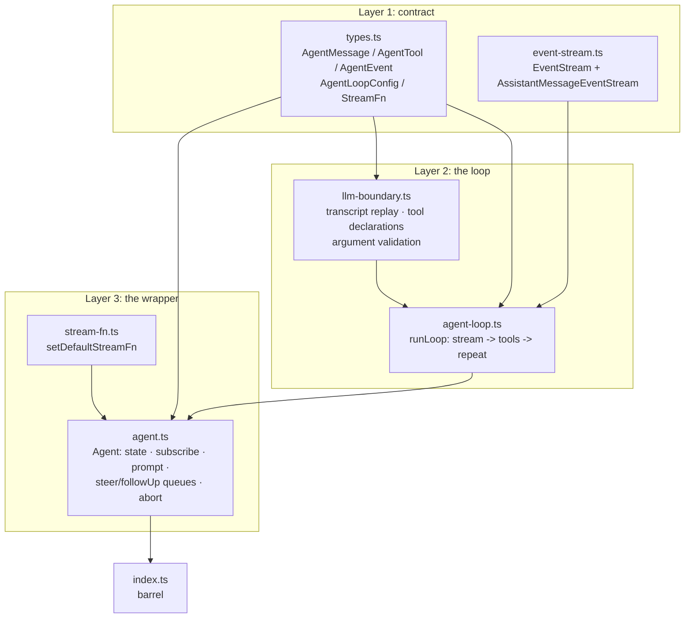

# reduced/agent — src overview

Standalone extraction of `packages/agent` (the root Agent/agent-loop production
path). Three layers: the contract, the loop, and the stateful wrapper.

## Layer 1: contract

2 files: types.ts, event-stream.ts

**`types.ts`** — the agent contract.
- `AgentMessage` = LLM messages (system/user/assistant/toolResult) plus app-defined custom messages via declaration merging
- `AgentTool`: name, description, typebox `parameters`, `label`, `execute(toolCallId, params, signal?, onUpdate?)` — tools throw on failure; the loop converts throws to error tool results
- `AgentEvent` — 10 kinds covering agent/turn/message/tool-execution lifecycle
- `AgentLoopConfig`: `convertToLlm` (AgentMessage -> LLM Message boundary, must not throw), `transformContext` (pre-LLM pruning), steering/follow-up providers, `shouldStopAfterTurn`, `prepareNextTurn`, before/after tool-call hooks, `toolExecution` mode
- `StreamFn`: one model request -> assistant event stream; failures arrive as normal assistant messages with stopReason "error"/"aborted", never as exceptions

**`event-stream.ts`** — the async event bus (verbatim, same port as reduced/ai).
- `EventStream<T, R>`: buffered async iteration + `result()` promise for the terminal value
- `AssistantMessageEventStream`: completes on `done`/`error`, extracting the final `AssistantMessage`

## Layer 2: the loop

2 files: agent-loop.ts, llm-boundary.ts

**`agent-loop.ts`** — the turn loop.
- `agentLoop(prompts, context, config, signal, streamFn?)`: wraps `runAgentLoop` in an `EventStream<AgentEvent, AgentMessage[]>`; `agentLoopContinue` resumes without a new prompt
- `runLoop`:
  - polls steering messages and injects them before the next request
  - `prepareNextTurn` may swap context/messages/model for the upcoming turn
  - streams an assistant response (transformContext -> convertToLlm -> streamFn -> event pump: `start` pushes the live partial, deltas replace it with `message_update`, `done`/`error` settle via `result()`)
  - extracts tool calls; on each batch: prepare (tool lookup + argument validation + `beforeToolCall` block semantics) -> execute -> `afterToolCall` field overrides -> `ToolResultMessage` appended
  - sequential mode runs one call at a time; parallel mode preflights sequentially, executes allowed tools concurrently, finalizes in completion order, emits result-message artifacts in assistant source order
  - early termination when every result in the batch sets `terminate`; graceful stop via `shouldStopAfterTurn`; follow-ups keep the loop alive after it would stop
  - stream failures terminate the run as a normal assistant message with stopReason "error"/"aborted"
- Termination: no tool calls + no steering/follow-ups, or `shouldStopAfterTurn`, or all-terminate batch, or stream error/abort

**`llm-boundary.ts`** — the AgentMessage -> LLM boundary helpers, extracted from pi-ai.
- `createInitialSystemMessage` / `getCurrentSystemMessage` / `getCurrentSystemPrompt`: the transcript's system messages are the prompt; replay yields the current one
- `toToolDeclaration`: typebox tool -> provider declaration
- `validateToolArguments`: schema-checks streamed tool arguments before execution

## Layer 3: the wrapper

2 files: agent.ts, stream-fn.ts

**`agent.ts`** — `Agent`, the stateful API.
- State: system prompt + transcript + tools (setters copy arrays), `isStreaming`, `streamingMessage`, `pendingToolCalls`, `errorMessage`
- `prompt(text | message | batch)` / `continue()` start runs; one run at a time — concurrent calls throw (use `steer`/`followUp`)
- Queues: steering messages inject after the current turn (`all` or `one-at-a-time` drain modes); follow-ups run only when the agent would otherwise stop
- `subscribe` listeners are awaited in subscription order and included in run settlement; `waitForIdle` resolves after `agent_end` listeners settle
- `processEvents` is the state reducer: message_end appends to the transcript, tool_execution_* maintain `pendingToolCalls`, turn_end records errors
- `abort()` fires the run's AbortController; `handleRunFailure` converts a thrown run into an error/aborted assistant message + full event sequence; `reset()` clears to the replayed prompt/tool baseline and throws while streaming

**`stream-fn.ts`** — process-wide fallback stream function for callers that omit `streamFn`.

