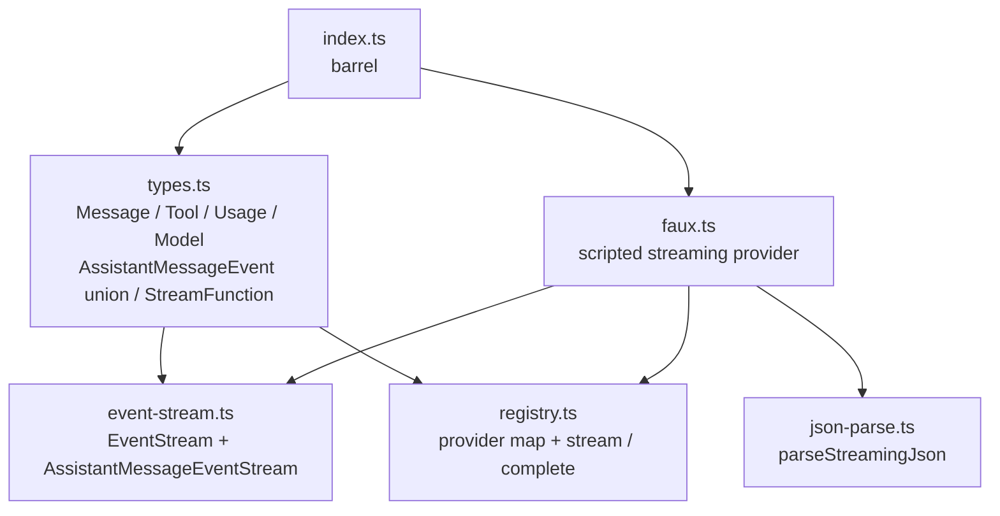

# reduced/ai — src overview

Standalone extraction of `packages/ai`. Two layers: the shared contract and
event spine, and the faux provider — the single in-process implementation of
the streaming contract. No wire protocol, no HTTP.

## Layer 1: contract and event spine

3 files: types.ts, event-stream.ts, json-parse.ts

**`types.ts`** — the whole LLM contract.
- Messages: `SystemMessage` (leading prompt), `UserMessage`, `AssistantMessage`, `ToolResultMessage`; content blocks are text, thinking (with `thinkingSignature`), and tool calls
- `Usage` with the five cost fields; `StopReason`: pending / stop / length / toolUse / error / aborted
- `Context` = systemPrompt + messages + tools; `Tool` uses typebox schemas
- `Model` = id, api, provider, reasoning, contextWindow, maxTokens, cost rates
- `AssistantMessageEvent` — 12 kinds from `start` through `done`/`error`; every non-terminal event carries the live `partial` accumulator
- `StreamOptions` = signal + sessionId + cacheRetention (in-process providers only — no HTTP transport options)
- `StreamFunction` = (model, context, options?) => AssistantMessageEventStream; sync throws are reserved for fatal setup errors

**`event-stream.ts`** — the async event bus every adapter shares.
- `EventStream<T, R>`: two-stack FIFO queue + waiting-consumer queue; `push` delivers or buffers; terminal events resolve `result()`
- `AssistantMessageEventStream`: completes on `done`/`error`, extracting the final `AssistantMessage`

**`json-parse.ts`** — streaming JSON parsing (verbatim).
- `parseStreamingJson` never throws: JSON.parse, then repair, then `partial-json`, then `{}`
- The contract says tool-call arguments arrive as partial-JSON deltas; this is what turns them into objects

## Layer 2: the provider

2 files: faux.ts, registry.ts

**`registry.ts`** — minimal model registry.
- `registerProvider({id, models, stream})` / `unregisterProvider`; `getModel`, `getModels`
- `stream(model, context, options)` dispatches on `model.provider`; `complete` awaits `.result()`

**`faux.ts`** — scripted provider; the reference implementation of `StreamFunction`.
- `registerFauxProvider({models?, tokensPerSecond?, tokenSize?})` returns a registration: `setResponses`/`appendResponses` queue steps (static `AssistantMessage` or a factory), `getModel`, `state.callCount`, `unregister`
- Streaming: emits the exact event choreography per content block — `start`, then thinking/text/toolcall `*_start`, token-sized `*_delta`s, `*_end` — with stable `contentIndex` and growing `partial`
- Usage estimation: tokens = ceil(chars/4) over the serialized context and output; per-`sessionId` prompt caching (first call -> cacheWrite, later calls -> cacheRead for the shared prefix)
- Terminal semantics: queue exhausted or factory throw -> error event; aborted signal -> aborted terminal; `pending` stopReason -> "Faux response ended without a stop reason"

## Verification

2 test files, 19 tests

- `event-stream.test.ts` (5, verbatim): drain order, post-completion push ignoring, waiter registration order, end with/without result
- `faux.test.ts` (14, trimmed): registration + usage estimation, helper blocks, queue order/exhaustion, factory throw, pending rejection, token formula, per-session caching, exact event order for fixed-size chunks, multiple tool calls, error terminal, abort (pre-chunk + mid-text), unregister

