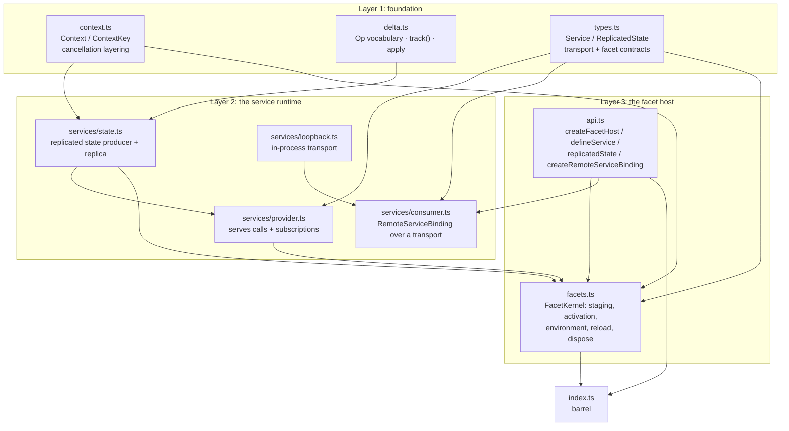

# reduced/chord — src overview

Standalone extraction of `packages/chord`. Three layers: the foundation
(context + delta protocol), the service runtime (provider + consumer over a
transport), and the facet host that composes them.

## Layer 1: foundation

3 files: context.ts, delta.ts, types.ts

**`context.ts`** — explicit invocation-scoped values and cancellation (verbatim).
- `Context` = immutable key/value chain (`value(key)` walks parents) plus an optional `abortSignal`
- `withContextValue` derives a child with one value; `withAbortSignal` combines signals; `withCancel` gives an independent cancellable child
- `awaitWithContext` races a promise against cancellation — only the waiter rejects, the underlying promise is untouched
- `BACKGROUND_CONTEXT` / `TODO_CONTEXT` are the two empty roots

**`delta.ts`** — the operation-log delta protocol for replicating JSON values.
- Op vocabulary: `["r", value]` replace, `["s", path, value]` set, `["d", path]` delete, plus `a` (string append), `t` (string truncate), `p` (array splice) — replicas understand all six
- `track(initial)`: mutate the returned proxy; every set/delete records one op with its full path; `flush()` returns pending ops; `rebase()` makes the next flush a single base `["r"]` batch (the recovery point)
- `apply(ops, value)` mutates in place; `applyImmutable(ops, value)` copies only containers along changed paths and structurally shares unchanged subtrees
- Base-batch contract: producers emit a base first; replicas hydrate from it (`isBase`), then apply incremental ops

**`types.ts`** — the whole composition contract.
- `Service<T>` identity (singleton or keyed mode) and `ServiceSpawner<T>` for multi-instance services
- `ReplicatedState` / `MutableReplicatedState`: immutable observed value + subscribe, tracked `state` proxy + `publish(context)`
- Wire shapes: `ServiceCall`, `ServiceProviderUpdate` (state / unavailable / replaced / spawned / closed), snapshots, `RemoteServiceTransport` (invoke + subscribe), `RemoteServiceBinding` (use / observe / ready / dispose / rebind)
- Facet contracts: `Facet.setup(env)`, `FacetEnvironment` (use / observe / provide / provideMany / replicatedState / own / onActivate / onDeactivate), `FacetHost` (services + reload + dispose)

## Layer 2: the service runtime

7 files under services/: provider, consumer, state, loopback, errors, handle, instances

**`services/state.ts`** — replicated state producer and replica.
- `MutableReplicatedStateImpl`: wraps a delta tracker; `publish()` flushes ops, advances the sequence, and notifies both source listeners (ops for the provider) and value listeners (consumers of the local state); first constructor flush establishes the base value
- `ReplicatedStateReplica`: cold consumer-side state — hydrates from a base batch, applies incremental ops, exposes the immutable value + subscribe

**`services/provider.ts`** — the host side serving services.
- Constructor takes the catalogue (service + mode); `provide(s, impl)` installs a singleton, `spawn(s, key, impl)` registers keyed instances
- Serving: `invoke(call)` dispatches to the implementation member with validated args; `subscribe(serviceId, mode, listener)` emits a snapshot then live `ServiceProviderUpdate`s — state members stream their delta ops per publish
- `use`/`observe`/`ready`/`dispose` mirror the consumer surface for local callers

**`services/consumer.ts`** — the client side over any transport.
- `RemoteServiceBindingImpl`: acquires declared services, builds local proxies — methods forward as `ServiceCall`s over `transport.invoke`; state members become replicas hydrated from the snapshot's base ops then updated by `state` updates
- `observe` delivers the handler per instance snapshot/update; `ready` waits for initial snapshots; `rebind` toggles availability; failures surface as `RemoteServiceError`

**`services/loopback.ts`** — the in-process transport connecting a binding directly to a provider (the reference `RemoteServiceTransport`).

**`services/errors.ts`** — `RemoteServiceError` with stable error codes (e.g. `service_not_found`, `service_mode_mismatch`).

**`services/{handle,instances}.ts`** — service slot views (lazy singleton handles) and the keyed instance directory (spawn/close, generation accounting).

## Layer 3: the facet host

2 files: facets.ts, api.ts

**`facets.ts`** — `FacetKernel`, the composition engine.
- `activate()`: run each facet's `setup(env)` to stage provides/uses; validate dependencies and order them topologically; install singleton implementations and wire keyed registries; assemble the provider; connect the internal loopback binding; run `onActivate` callbacks once dependencies are ready
- The environment implementation: `provide` stages a singleton, `provideMany` returns a staged spawner whose `spawn` registers keyed instances, `use`/`observe` declare hard dependencies resolved after activation, `replicatedState` creates tracked state wired to the provider, `own` registers cleanup, `onDeactivate` queues teardown
- `reload(facets)`: replaces facets with matching IDs while keeping untouched services live and consumer handles connected
- `dispose()`: deactivate callbacks, owned disposals (reverse order), provider teardown
- The host-facing `services` surface: local singletons served directly, everything else through the internal loopback binding; also exposes `invoke`/`subscribe` so external transports can serve the same catalogue

**`api.ts`** — the public entry functions: `createFacetHost`, `createStaticFacetLoader` + `combineFacetLoaders` (ordered loading with reverse-order disposal), `defineFacet`, `defineService` (reserved `$chord.` namespace check), `replicatedState`, `createRemoteServiceBinding`.

