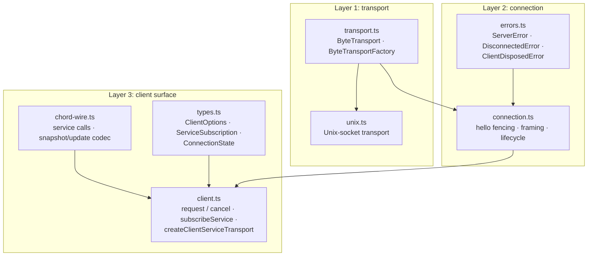

# reduced/client — src overview

Standalone extraction of `packages/client`. Three layers: the connection
state machine, the client RPC/subscription surface, and the concrete byte
transport. Imports the wire protocol from `reduced/protocol` and the service
contract + delta apply from `reduced/chord`.

## Layer 1: transport

2 files: transport.ts, unix.ts

**`transport.ts`** — the byte-transport seam (verbatim).
- `ByteTransport`: ordered `send(chunk)` + idempotent `close()`
- `ByteTransportFactory`: creates a fresh connected transport and reports exactly one terminal event (`onData` chunks, `onClose`, `onError`)

**`unix.ts`** — the concrete Unix-domain-socket transport.
- `createUnixTransportFactory({ path })`: connects a socket and adapts it — socket `data` -> `onData`, `end`/`close` -> `onClose`, `error` -> `onError`
- Sends are serialized through a write tail so chunks reach the socket in invocation order; each write settles on its socket callback

## Layer 2: connection

2 files: connection.ts, errors.ts

**`connection.ts`** — the framed-connection state machine (verbatim).
- Lifecycle: disconnected -> connecting (fresh decoder + transport + handshake promise) -> connected
- `connect()` opens the transport, sends the client hello (protocol version), and resolves on the server hello; a `hello_error` becomes a `ServerError`; any other first message, wrong `serverId`, data-before-hello, or unexpected handshake rejects and closes
- `#handleData` feeds arbitrary byte chunks through the incremental `ServerMessageDecoder`; decoder/framing failures fail the connection
- `send` writes only while connected; transport send failures disconnect
- Disconnect/fail: rejects the pending handshake, notifies state listeners with the error, closes the transport

**`errors.ts`** — `ServerError` (carries the protocol error `code`), `DisconnectedError` (with cause chaining), `ClientDisposedError`, `toError`/`toDisconnectedError`.

## Layer 3: client surface

4 files: chord-wire.ts, client.ts, types.ts, index.ts

**`chord-wire.ts`** — the client half of the service wire protocol.
- Control-call builders: catalogue / subscribe / unsubscribe against the reserved `$chord.service` service
- Shape validation for `ServiceCall`, `ServiceCatalogueEntry`, subscription snapshots, provider updates (state / unavailable / replaced / spawned / closed)
- `ServiceStateDecoder`: per-subscription pass-through decoder (no wire-op compression in the reduced delta — ops travel as plain `Op[]` and are validated by `applyImmutable` on the consumer)
- `applyStateOps`: folds an update's ops into the previous value

**`client.ts`** — the RPC and subscription surface.
- `Client.connect` / `reconnect`: hello exchange through the connection; `hello` snapshot retained
- `request(target, call, signal?)`: id-correlated; abort sends a `cancel` frame without disconnecting; responses resolve pending requests, failures surface as `ServerError`; disconnect/dispose rejects everything pending
- `serviceCatalogue`: request + catalogue shape validation (a validation failure fails the connection)
- `subscribeService`: sends subscribe, hydrates from the snapshot response, queues updates that arrive before hydration, delivers them in order after `start()` (serialized through a delivery tail so listener promises settle in order), `dispose()` sends unsubscribe
- `createClientServiceTransport(client, getTarget)`: adapts the client to chord's `RemoteServiceTransport` (invoke + subscribe with snapshot/activate/close)

**`types.ts`** — `ClientOptions` (transport factory, expected `serverId`, frame limit, listener-error reporter), `ConnectionState`/`ConnectionStateChange`, `ServiceSubscription`, `Unsubscribe`.

**`index.ts`** — barrel.

