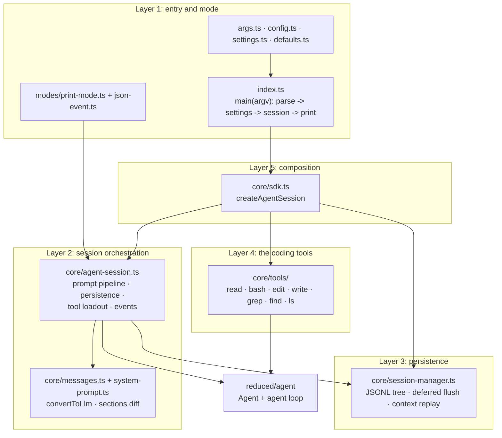

# reduced/coding-agent — src overview

Standalone extraction of `packages/coding-agent` (print-mode slice). Four
layers: entry/mode, the session orchestration, the JSONL persistence, and the
coding tools. Imports the agent loop from `reduced/agent` and (in tests) the
faux provider from `reduced/ai` via relative paths — the real layering.

## Layer 1: entry and mode

5 files: args.ts, cli.ts, config.ts, settings.ts, core/defaults.ts, modes/print-mode.ts, modes/json-event.ts

**`args.ts`** — trimmed CLI parser.
- Flags: `--mode text|json`, `--model provider/id`, `--api-key`, `--system-prompt`, `--append-system-prompt`, `--thinking`, `--tools/-t`, `--exclude-tools`, `--no-tools`, `--no-session`, help/version
- Positional messages + `@file` reads; unknown flags throw
**`config.ts`** — APP_NAME/VERSION + agent-dir resolution (env override, `~/.pi/agent`).
**`settings.ts`** — slim Settings (default provider/model/thinking/tools) with file or default load.
**`modes/print-mode.ts`** — subscribes to session events, sends each message via `session.prompt`; text mode prints the assistant answer (error/aborted -> stderr + exit code 1); json mode writes one `toJsonEvent` line per event with stdout backpressure handling.
**`modes/json-event.ts`** — byte-faithful wire mapper: strips cumulative `partial` snapshots from `message_update`, keeps usage, adds id/toolName at `toolcall_start`.

## Layer 2: session orchestration

3 files: core/agent-session.ts, core/system-prompt.ts, core/messages.ts

**`core/agent-session.ts`** — the orchestration shell around the loop.
- `prompt(text)`: if streaming -> `steer`/`followUp` queues; else build the user message, prepend a system-prompt sections patch when the prompt/tool loadout changed (`diffSystemPromptSections`), refresh `agent.state.tools`, run
- Run lifecycle: `agent.prompt` then `while (hasQueuedMessages) agent.continue()`; emits `agent_settled` when settled
- Persistence: on every `message_end`, `sessionManager.appendMessage(event.message)` — the transcript replay survives restarts
- Tool API: registry of `ToolDefinition`s, `setActiveToolsByName`, default active `[read, bash, edit, write]`, tools restored from the replayed transcript's `tools` section
- Model/thinking management: `setModel`/`setThinkingLevel` (persisted via session entries)

**`core/system-prompt.ts`** — named prompt sections.
- `buildSystemPromptSections`: ordered sections (preamble, tools, rules, docs, project context, addendum) from tool snippets/guidelines + options
- `diffSystemPromptSections`: computes a `SystemMessage.sections` patch against the transcript's latest sections — the mechanism that updates the prompt mid-transcript without rewriting history

**`core/messages.ts`** — the AgentMessage -> LLM Message boundary.
- `convertToLlm` passes the four standard roles; SystemMessage gains `sections` via declaration merging
- `foldSystemSections` replays section updates in transcript order

## Layer 3: persistence

1 file: core/session-manager.ts

**`core/session-manager.ts`** — append-only JSONL session tree.
- Format: header line `{type: "session", id (uuidv7), cwd, version: 3}` + entries `{type, id (8-hex), parentId, timestamp, ...}` — a tree with a moving leaf
- Entry types (reduced): message, thinking_level_change, model_change, session_info
- Write path: file creation deferred until the first assistant message (an aborted first turn writes nothing); every append updates the file, the by-id index, and the leaf
- Read path: streaming line parse + header validation + v1->v3 migrations; `buildSessionContext` walks leaf->root and replays entries into `{messages, model, thinkingLevel}` for Agent restore
- Factories: `create(cwd)`, `open(path)`, `inMemory()`

## Layer 4: the coding tools

16 files under core/tools/

**Shared** — `types.ts` (ToolDefinition: name/label/description/typebox parameters/promptSnippet/promptGuidelines/prepareArguments/execute + `wrapToolDefinition` to AgentTool), `truncate.ts` (2000-line/50KB head-tail truncation with continuation notices, verbatim), `file-mutation-queue.ts` (per-realpath write serialization), `path-utils.ts`, `output-accumulator.ts` (streaming tail decoder), `render.ts` (one generic renderer), `shell.ts` (POSIX shell config/env, kill-process-tree, child-process wait).

**Tools** — every tool: typebox schema -> execute -> `{content, details}`:
- `read.ts`: offset/limit paging + truncation + continuation notices (text only)
- `bash.ts`: persistent-cwd-less spawn with abort, timeout, exit-code/signal mapping, kill-tree, 100ms-throttled streaming snapshots, tail-truncation footers
- `edit.ts`: exact-text multi-edit — uniqueness/no-overlap enforcement, fuzzy matching with unchanged-line preservation, CRLF + BOM handling, model-argument repair
- `write.ts`: mkdir -p + write inside the mutation queue
- `grep.ts`: ripgrep `--json` streaming with match limits, context lines, byte truncation
- `find.ts`: fd with gitignore respect (`--no-require-git` outside repos), glob/path patterns, result limits
- `ls.ts`: directory listing with sorting and limits

## Layer 5: composition

1 file: core/sdk.ts

**`core/sdk.ts`** — `createAgentSession(options)`.
- Resolves cwd, SessionManager (created or injected), tool loadout (builtin `createAllTools` or `baseTools` replacement, filtered by `tools`/`excludeTools`/`noTools` names), model placeholder (`provider/id` string), thinking level
- Builds the root Agent: `{initialState, convertToLlm, streamFn (injected or throw-on-use), getApiKey}`
- Restores `agent.state.messages` from `sessionManager.buildSessionContext()`; fresh sessions record initial model/thinking entries
- Returns `{session, sessionManager, model}`

