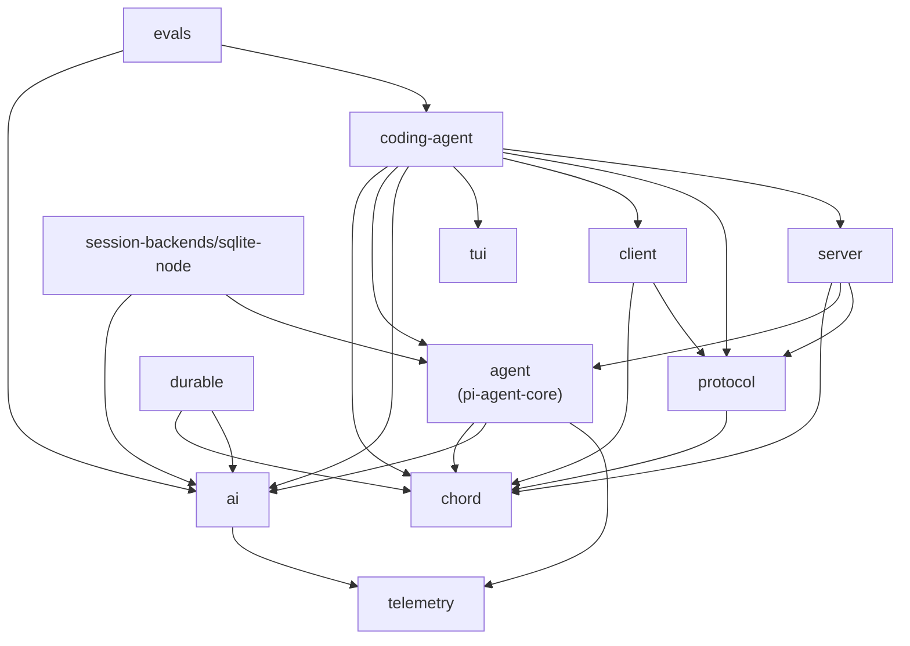

# packages/ — sub-package relationships

Twelve packages under `packages/` (plus the `session-backends/` folder wrapper).
Dependency edges below come from each package's `package.json`
(`@earendil-works/*` dependencies only). `coding-agent` is the composition root;
`chord` is the shared foundation.

## Layers (bottom = depended on by everything above)

**Foundation — no internal dependencies**

- **chord** — application composition runtime: services, replicated state, RPC, plugins. Supplies `Context` and `BACKGROUND_CONTEXT` used across the stack.
- **telemetry** — vendor-neutral telemetry contracts and typed schema utilities.
- **tui** — terminal UI library with differential rendering; standalone, consumed only by coding-agent.

**Primitives**

- **ai** (`pi-ai`) — unified LLM API: model discovery, provider config, streaming. Depends on telemetry.
- **protocol** (`pi-protocol`) — transport-neutral CBOR protocol for remote pi sessions. Depends on chord.

**Core runtime**

- **agent** (`pi-agent-core`) — the general-purpose agent: agent loop, harness, session contract (`Session`/`Storage`/`SessionRepo` types live in its `harness/session/`). Depends on chord, ai, telemetry. Nearly everything buildable sits on it.
- **durable** (`pi-durable`) — durable conversation, task, and document runtime. Depends on chord, ai.
- **session-backends/sqlite-node** — implements agent-core's `Storage`/`SessionRepo` contract on `node:sqlite` (the package this repo folder `reduced/session-backends` mirrors). Depends on ai, agent-core. The `session-backends/` directory is a wrapper folder holding backend packages; more backends can live beside sqlite-node.

**Remote sessions**

- **client** (`pi-client`) — transport-neutral client for remote sessions over framed CBOR. Depends on chord, protocol.
- **server** (`pi-server`) — experimental server exposing sessions over transports. Depends on chord, agent, protocol.

**Composition root**

- **coding-agent** (`pi-coding-agent`) — the pi CLI: read/bash/edit/write tools, session management, TUI. Depends on chord, agent, ai, tui, client, protocol, server — the only package that touches every layer below it except durable and session-backends.

**Verification**

- **evals** (`pi-evals`, private) — model-backed behavioral evals: runs a real `AgentSession` against a live provider. Depends on ai, coding-agent. Nothing depends on it; it sits outside the runtime graph.

## Observations

- `chord` is the only package everyone (except tui) transitively relies on; `telemetry` and `ai` form the other shared base.
- The remote-session pair (protocol + client + server) is fully separable: coding-agent consumes it, but agent-core never does.
- `session-backends/*` and `durable` are both persistence-ish layers over agent-core/ai but are mutually independent.
- No cycles anywhere; the graph is a clean DAG rooted at chord/telemetry.
