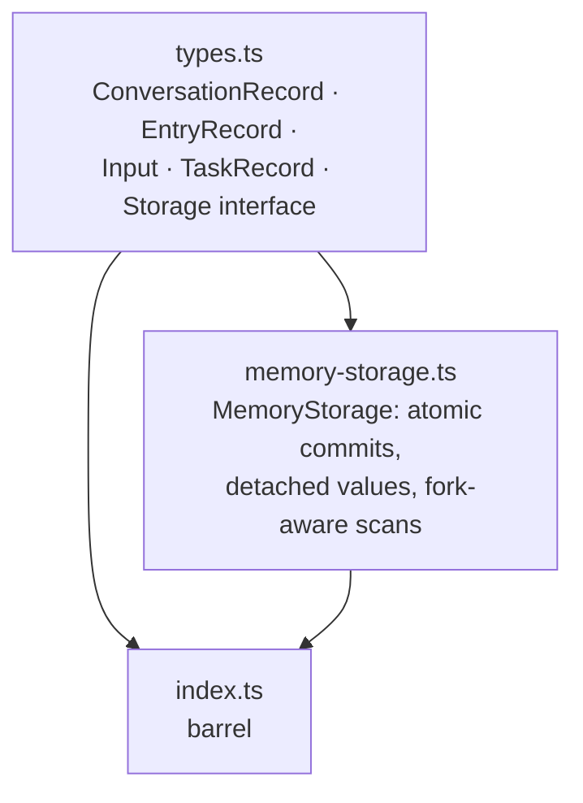

# reduced/durable — src overview

Standalone extraction of `packages/durable`. Two files carry everything: the
record model and storage contract (`types.ts`), and the detached in-memory
reference backend (`memory-storage.ts`).

## Layer 1: the record model and storage contract

1 file: types.ts

**`types.ts`** — four record tables and the persistence boundary.
- `ConversationRecord`: a transcript scope with optional fork ancestry (`parent: { conversationId, at }`) and creator edge (`owner`)
- `EntryRecord`: an immutable transcript event — `kind` discriminator, optional `model` messages (model-facing), optional `data` JSON (application-facing), optional `head` (active-context start marker) and `edits` (omit/replace overrides of earlier entries); `EntryDraft` is the pre-identity input shape
- `Input`: one host input's durable lifecycle — queued -> placed (entry id) -> done (optional answer entry) | unanswered (machine-readable reason)
- `TaskRecord<I, S, R>`: a durable task state machine — pending/running carry a resumable `checkpoint` and optional live `memos`; terminal carries a `TaskOutcome` (completed | failed | aborted | orphaned | faulted); `after` encodes dependencies, `abortRequested` is the durable abort mark
- `Storage`: the atomic boundary — `commit(writes) -> Seq` across all four tables, `mintId` from one global namespace, point lookups plus newest-first cursor-paginated scans, `findLatestHeadMarker` for fork-aware active-context resolution, `close`

## Layer 2: the reference backend

1 file: memory-storage.ts

**`memory-storage.ts`** — detached in-memory `Storage` implementation.
- **Detachment**: `clone` deep-copies every write and every read, preserving prototype-less objects (a `__proto__` own-key from `JSON.parse` stays an own key) — matching the ownership boundary of serialization-backed stores
- **Atomicity**: `commit` clones and ID-checks the whole batch (`checkImmutableIds`: conversation/entry IDs immutable, one global namespace, no cross-table reuse) before applying any mutation, so a rejected batch rolls everything back
- **Indexing**: sorted ID arrays per table plus per-conversation entry lists, head-marker lists, task-by-status lists, and request-id maps — kept in sync on every write; `nextId` always passes the highest written ID
- **Fork-aware scans**: `visibleEntries` walks the conversation's parent chain newest-first, capping each ancestor at the fork point; `findLatestHeadMarker` walks the same chain to find the newest `head` marker at or before a cutoff
- **Pagination**: opaque `{ after: id }` cursors; `page` slices and clones

