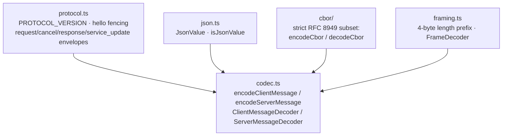

# reduced/protocol — src overview

Standalone extraction of `packages/protocol`. Three layers: the message
envelope schemas, the byte pipeline (CBOR + framing), and the validated
codec that binds them.

## Layer 1: message envelopes

1 file: protocol.ts

**`protocol.ts`** — typebox schemas defining every wire message.
- `PROTOCOL_VERSION` (8) gates both sides: the client hello carries the version it wants; the server answers `hello` with its exact version or `hello_error`
- `RpcTarget` fences every call: server-wide (`serverId`) or session-scoped (`serverId` + `sessionId` + `attachmentId`); `ServerId` is a UUID pattern
- Client messages: `hello` | `request` (id, target, opaque JSON call) | `cancel` (id, target)
- Server messages: `hello` | `hello_error` | `response` (ok:true with optional result | ok:false with `ProtocolError{code, message}`) | `service_update` (subscriptionId + opaque update)
- All objects are `additionalProperties: false`; opaque payload fields are typed `JsonValue` and additionally checked by `isJsonValue` at parse time

## Layer 2: the byte pipeline

4 files: cbor/options.ts, cbor/encoder.ts, cbor/decoder.ts, framing.ts

**`cbor/options.ts`** — safe defaults for untrusted payloads: 16 MiB byte length, 1M container entries, depth 64; `CborError`; UTF-8 encoder/decoder with fatal invalid sequences.

**`cbor/encoder.ts`** — strict definite-length CBOR writer.
- Types: null/bool, safe integers (major 0/1, unsigned or negative), float64 for everything else finite, text/byte strings, arrays, string-keyed maps (undefined values dropped)
- Rejects: cycles, holes, undefined array items, symbol keys, non-plain objects, over-limit strings/containers/depth

**`cbor/decoder.ts`** — the matching strict reader.
- One item per payload with a trailing-data check; rejects tags, indefinite lengths, break markers, non-string/duplicate map keys, out-of-safe-range integers, non-finite floats
- Map keys are defined via `Object.defineProperty` so `__proto__`-shaped keys cannot pollute prototypes

**`framing.ts`** — length-prefixed framing.
- `encodeFrame`: 4-byte unsigned big-endian length header + payload
- `FrameDecoder.push(chunk)`: reassembles frames across arbitrary chunk boundaries using bounded 64 KiB blocks; enforces `maxFrameLength`; `end()` rejects truncated tails; a failure poisons the decoder state

## Layer 3: the validated codec

2 files: codec.ts, json.ts

**`codec.ts`** — binds schemas, CBOR, and framing into one pipeline.
- `parseClientMessage` / `parseServerMessage`: typebox `Check` + strict-JSON `isJsonValue`; failures throw `ProtocolValidationError`
- `encodeClientMessage` / `encodeServerMessage`: validate, CBOR-encode, frame; encoding failures are wrapped with a bounded (500-char) cause message
- `ClientMessageDecoder` / `ServerMessageDecoder`: incremental decode — push arbitrary byte chunks, receive validated messages; the first invalid frame poisons the decoder
- `isSupportedProtocolVersion`: exact-version gate for the hello exchange

**`json.ts`** — reduced chord stand-ins: `JsonValue` and `isJsonValue` (strict JSON with finite numbers, plain objects/arrays, cycle detection).

