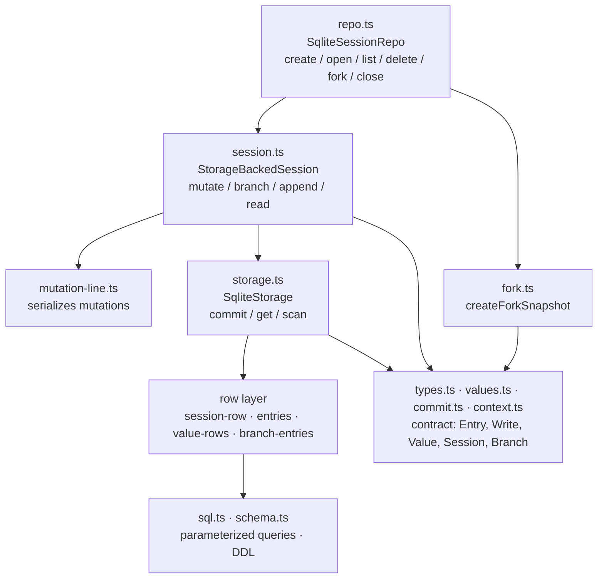

# reduced/session-backends — src overview

Standalone extraction of `packages/session-backends/sqlite-node`: a durable
session store on `node:sqlite` with an entry tree, materialized branch
segments, and typed values. `src/` has 16 files in four layers.

## Layer 1: contract (ported from `@earendil-works/pi-agent-core`)

| File | What it does |
|---|---|
| `types.ts` (219) | The data contract. `Entry` union (`message` \| `compaction` \| `custom`), each with `id`/`parentId`/`seq`/`timestamp` — entries form a tree via `parentId`. `Write` = entry set + value set/delete + list append/delete. `Storage` is the async row-store interface (commit, getEntries, getValue, scanValues, readList, scanBranch, scanEntries, getStats, close). `Session`/`Branch`/`SessionMutation` are the read-modify-write API above it; `SessionRepo` is create/open/list/delete/fork. `SessionStats` is `{ messageCount }`. `SqliteDatabase = DatabaseSync` from `node:sqlite`. |
| `values.ts` (112) | Typed storage addresses: `value<T>(namespace, key)` for single values, `list<T>(namespace, key)` for append-only lists. Write builders (`setValue`, `deleteValue`, `appendList`, `deleteList`). Well-known addresses: `branchTip(branch)` (`pi.branch.tip`), `sessionName`, `entryLabel(id)`. `resolveListReadOptions` defaults `{ order: "asc", limit: 1000 }`. |
| `commit.ts` (73) | Turns pending writes into committed ones: `prepareStorageCommit(writes, firstSeq, timestamp)` assigns consecutive `seq`s and stamps entries with a timestamp. `insertEntry` wraps a `NewEntry` (no seq/timestamp yet) as a write. |
| `context.ts` (5) | Opaque `Context` marker + `BACKGROUND_CONTEXT`. The real package's context carries an abort signal and keyed values; nothing here reads it. |
| `mutation-line.ts` (23) | `MutationLine`: promise-chain serializer for one session's read-modify-write jobs. `run()` queues an operation; `seal(error)` rejects everything queued after close. |

## Layer 2: SQLite plumbing

| File | What it does |
|---|---|
| `sql.ts` (74) | `sql` template tag building a parameterized `SqlQuery` (interpolations become `?` params, nested queries inline). `joinSqlFragments` composes WHERE pieces. `inTransaction(db, fn)` = BEGIN / COMMIT, with rollback-and-rethrow — the only `try` in the reduced copy. |
| `schema.ts` (81) | `applySchema(db)`: latest DDL only, no migrations. Tables: `sessions` (id, created_at, parent_session_id, message_count, next_seq), `entries`, `scalar_values`, `list_values`, and the branch projection `branch_entries` + `branch_meta` (branch_id → tip_entry_id/tip_seq, optional base_branch_id/base_seq for segments rooted at a compaction). |

## Layer 3: row layer (all queries live here)

| File | What it does |
|---|---|
| `session-row.ts` (86) | `sessions` table CRUD: read one/all rows, `hasSessionRow`, insert (nextSeq parameterized, message_count 0), delete all rows for a session. Plus stats (`readSessionStats` = message_count) and the commit sequence (`readNextSeq` / `advanceNextSeq` — every commit takes `next_seq` and advances it). |
| `entries.ts` (107) | `entries` table. `entryPayload` splits an entry into indexed columns (id, parent, seq, type, custom_type, timestamp) and a JSON payload (`message` / `summary+retainedTail+tokensBefore` / `data`). `insertEntryRow`, `decodeEntryRow`, lookup by ids, full scan, filtered `scanEntryRows` (type/customType/seq bounds/order/limit). |
| `value-rows.ts` (146) | `scalar_values` (upsert by namespace+key) and `list_values` (append, PK includes seq). `scanScalarValueRows` implements the prefix range: upper bound = prefix with its last code point incremented (surrogate-range aware, so `app:` stops before `app;`). `readListValueRows` pages asc/desc by seq cursor. |
| `branch-entries.ts` (277) | The branch index — the heart of the tree model. On every committed entry, `appendEntryToBranchIndex`: parent null → new root branch; parent is some branch's tip → append to it and bump its tip; otherwise (divergence) → create a new branch segment whose base is the newest compaction on the parent's path, copying the parent-path entries after that compaction. `scanBranchEntries({ start, order, stopAtType, cursor, limit })` walks the segment chain (newest first, reversing for oldest-first) and joins `branch_entries` to `entries` for payloads. |

## Layer 4: storage, session, fork, repo

| File | What it does |
|---|---|
| `storage.ts` (128) | `SqliteStorage implements Storage` over one open `DatabaseSync`. `commit` = one `inTransaction`: read `next_seq`, `prepareStorageCommit`, then per write — entry → `insertEntryRow` + `appendEntryToBranchIndex` (+ message_count bump for message entries); value → upsert/delete; list → append/delete rows; advance `next_seq`; return `{ firstSeq, seqs, timestamp, stats }`. All reads (getEntries/getValue/scanValues/readList/scanBranch/scanEntries/getStats) are synchronous SQLite reads behind async signatures. |
| `session.ts` (386) | `StorageBackedSession` — the API layer. Mutations (createBranch, setValue, appendToBranch, ...) run through `mutate()`: acquire the mutation line, read current state, commit entry+tip writes atomically. `appendToBranch` generates an id (`crypto.randomUUID`), parents the new entry at the branch tip, and advances the tip in the same commit. Reads delegate to storage; `getName`/`getLabel` read well-known value addresses. `close` seals the mutation line, closes storage, fires `onClose`. `StorageBackedBranch` exposes getTipId/appendMessage/appendCustomEntry/findEntries per branch. |
| `fork.ts` (113) | `createForkSnapshot(source, options)` builds destination state from a source snapshot (entries + scalar values). `tree` scope copies everything; `branch` scope walks the tip's parent chain down to the requested `entryId` (default: tip) and copies only that path. Scalar projection keeps `pi.session.name`, copies `pi.entry.label` only for copied entries, and for `pi.branch.tip` keeps just the forked branch pointed at the new destination tip (tree scope keeps all tips). Kept values get fresh seqs after the copied entries. |
| `repo.ts` (216) | `SqliteSessionRepo` — file lifecycle. One `<id>.sqlite` per session under `directory`. `create`: mkdir → `new DatabaseSync(path)` (creates) → WAL + busy_timeout pragmas → `applySchema` → insert session row (next_seq = 1) inside a transaction with a duplicate-id check. `open`: open the metadata path, read + validate the row. `list`: read-only scan of `*.sqlite` files, sorted by createdAt desc. `delete`: verify the row exists, then rm the db + `-wal`/`-shm` sidecars. `fork`: snapshot the source db read-only → `createForkSnapshot` → create the destination file and bulk-insert entries, branch index, and values. `close` closes all open sessions; later repo calls throw "SqliteSessionRepo is closed". |
| `index.ts` (14) | Barrel re-exporting everything. |
