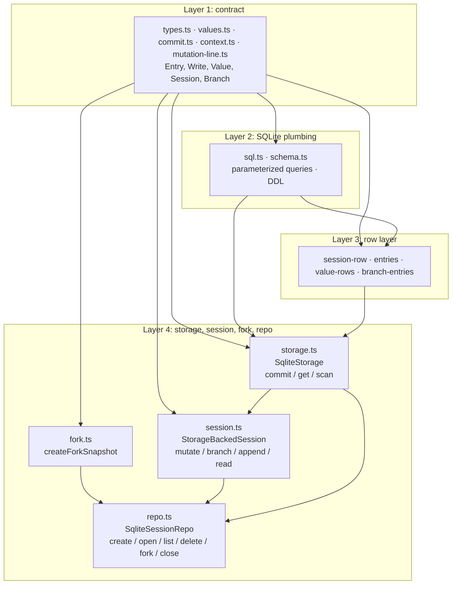

# reduced/session-backends — src overview

Standalone extraction of `packages/session-backends/sqlite-node`: a durable
session store on `node:sqlite` with an entry tree, materialized branch
segments, and typed values. `src/` has 16 files in four layers.

## Layer 1: contract (ported from `@earendil-works/pi-agent-core`)

5 files: types.ts, values.ts, commit.ts, context.ts, mutation-line.ts

**`types.ts`** — the data contract everything shares.
- `Entry` union (`message` | `compaction` | `custom`), each with `id`/`parentId`/`seq`/`timestamp`; entries form a tree via `parentId`
- `Write` = entry insert + scalar value set/delete + list append/delete
- `Storage`: the async row-store interface (commit, getEntries, getValue, scanValues, readList, scanBranch, scanEntries, getStats, close)
- `Session` / `Branch` / `SessionMutation`: the read-modify-write API above storage; `SessionRepo`: create/open/list/delete/fork
- `SessionStats` is `{ messageCount }`; `SqliteDatabase = DatabaseSync` from `node:sqlite`

**`values.ts`** — typed storage addresses.
- `value<T>(namespace, key)` for single values, `list<T>(namespace, key)` for append-only lists
- Write builders: `setValue`, `deleteValue`, `appendList`, `deleteList`
- Well-known addresses: `branchTip(branch)` (`pi.branch.tip`), `sessionName`, `entryLabel(id)`
- `resolveListReadOptions` defaults `{ order: "asc", limit: 1000 }`

**`commit.ts`** — turns pending writes into committed ones.
- `prepareStorageCommit(writes, firstSeq, timestamp)` assigns consecutive `seq`s and stamps entries with a timestamp
- `insertEntry` wraps a `NewEntry` (no seq/timestamp yet) as a write

**`context.ts`** — opaque `Context` marker + `BACKGROUND_CONTEXT`.
- The real package's context carries an abort signal and keyed values; nothing here reads it

**`mutation-line.ts`** — `MutationLine`, promise-chain serializer.
- `run()` queues one session's read-modify-write job; `seal(error)` rejects everything queued after close

## Layer 2: SQLite plumbing

2 files: sql.ts, schema.ts

**`sql.ts`** — parameterized query building.
- `sql` template tag: interpolations become `?` params, nested queries inline
- `joinSqlFragments` composes WHERE pieces
- `inTransaction(db, fn)` = BEGIN / COMMIT with rollback-and-rethrow — the only `try` in the reduced copy

**`schema.ts`** — `applySchema(db)`, latest DDL only, no migrations.
- Tables: `sessions` (id, created_at, parent_session_id, message_count, next_seq), `entries`, `scalar_values`, `list_values`
- Branch projection: `branch_entries` + `branch_meta` (branch_id → tip_entry_id/tip_seq, optional base_branch_id/base_seq for segments rooted at a compaction)

## Layer 3: row layer (all queries live here)

4 files: session-row.ts, entries.ts, value-rows.ts, branch-entries.ts

**`session-row.ts`** — `sessions` table plus counters.
- CRUD: read one/all rows, `hasSessionRow`, insert (nextSeq parameterized, message_count 0), delete all rows for a session
- Stats: `readSessionStats` = `{ messageCount }`
- Commit sequence: `readNextSeq` / `advanceNextSeq` — every commit takes `next_seq` and advances it

**`entries.ts`** — the `entries` table.
- `entryPayload` splits an entry into indexed columns (id, parent, seq, type, custom_type, timestamp) and a JSON payload
- `insertEntryRow`, `decodeEntryRow`, lookup by ids, full scan
- Filtered `scanEntryRows` (type/customType/seq bounds/order/limit)

**`value-rows.ts`** — `scalar_values` and `list_values`.
- Scalar values: upsert by namespace+key
- List values: append-only, PK includes seq; `readListValueRows` pages asc/desc by seq cursor
- `scanScalarValueRows` prefix range: upper bound = prefix with its last code point incremented (surrogate-range aware, so `app:` stops before `app;`)

**`branch-entries.ts`** — the branch index; the heart of the tree model.
- `appendEntryToBranchIndex` on every committed entry:
  - parent null → new root branch
  - parent is some branch's tip → append to it and bump its tip
  - otherwise (divergence) → new branch segment based at the newest compaction on the parent's path, copying parent-path entries after that compaction
- `scanBranchEntries({ start, order, stopAtType, cursor, limit })`: walks the segment chain (newest first, reversing for oldest-first), joins `branch_entries` to `entries` for payloads

## Layer 4: storage, session, fork, repo

5 files: storage.ts, session.ts, fork.ts, repo.ts, index.ts

**`storage.ts`** — `SqliteStorage implements Storage` over one open `DatabaseSync`.
- `commit` = one `inTransaction`: read `next_seq` → `prepareStorageCommit` → per write:
  - entry → `insertEntryRow` + `appendEntryToBranchIndex` (+ message_count bump for message entries)
  - value → upsert/delete; list → append/delete rows
- Advances `next_seq`, returns `{ firstSeq, seqs, timestamp, stats }`
- All reads (getEntries/getValue/scanValues/readList/scanBranch/scanEntries/getStats) are synchronous SQLite reads behind async signatures

**`session.ts`** — `StorageBackedSession`, the API layer.
- Mutations (createBranch, setValue, appendToBranch, ...) run through `mutate()`: acquire the mutation line, read current state, commit atomically
- `appendToBranch` generates an id (`crypto.randomUUID`), parents the entry at the branch tip, and advances the tip in the same commit
- Reads delegate to storage; `getName`/`getLabel` read well-known value addresses
- `close` seals the mutation line, closes storage, fires `onClose`
- `StorageBackedBranch` exposes getTipId/appendMessage/appendCustomEntry/findEntries per branch

**`fork.ts`** — `createForkSnapshot(source, options)`, builds destination state from a source snapshot.
- `tree` scope copies everything; `branch` scope walks the tip's parent chain down to the requested `entryId` (default: tip) and copies only that path
- Scalar projection:
  - keeps `pi.session.name`
  - copies `pi.entry.label` only for copied entries
  - `pi.branch.tip`: keeps just the forked branch, pointed at the new destination tip (tree scope keeps all tips)
- Kept values get fresh seqs after the copied entries

**`repo.ts`** — `SqliteSessionRepo`, file lifecycle; one `<id>.sqlite` per session under `directory`.
- `create`: mkdir → `new DatabaseSync(path)` (creates) → WAL + busy_timeout pragmas → `applySchema` → insert session row (next_seq = 1) in a transaction with a duplicate-id check
- `open`: open the metadata path, read + validate the row
- `list`: read-only scan of `*.sqlite` files, sorted by createdAt desc
- `delete`: verify the row exists, then rm the db + `-wal`/`-shm` sidecars
- `fork`: snapshot the source db read-only → `createForkSnapshot` → create the destination and bulk-insert entries, branch index, values
- `close` closes all open sessions; later repo calls throw "SqliteSessionRepo is closed"

**`index.ts`** — barrel re-exporting everything.

