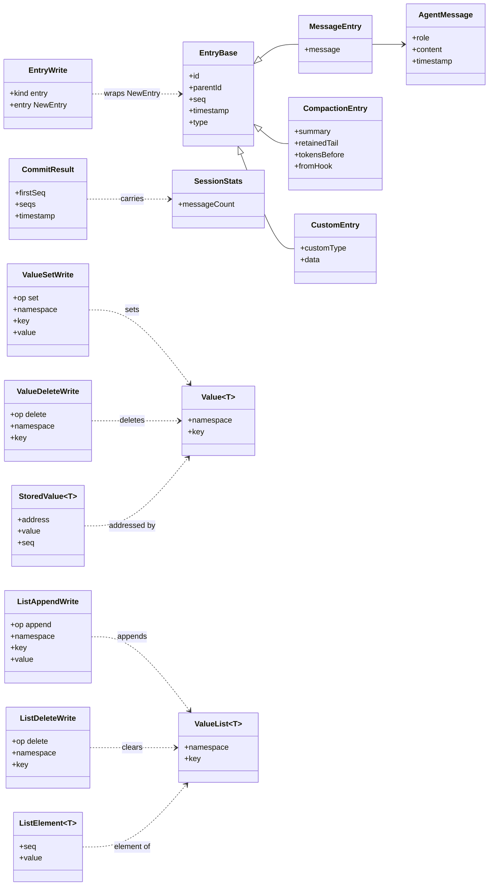
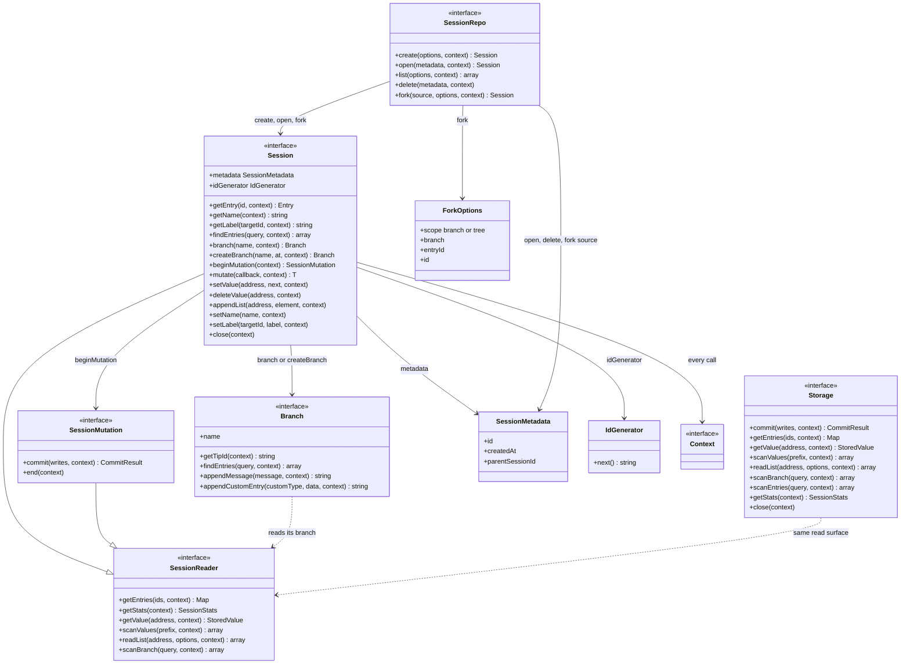

# types.ts — relationship diagram

Layer 1 of `reduced/session-backends/src` is the contract: data shapes that move
through storage, and the three API tiers (`Storage` -> `Session` -> `SessionRepo`)
that consume them. Two views below; all names live in `src/types.ts` (address
shapes in `src/values.ts`).

Arrows: `--|>` inheritance/extends, `-->` references/holds, `..>` uses/produces.

## Data shapes

`Entry` is the union of the three entry kinds; every entry is a node in a tree
via `parentId`. A commit (`Write`) applies one or more of: a new entry
(`EntryWrite`, later stamped with `seq`/`timestamp`), a scalar value set/delete,
or a list append/delete. `CommitResult` reports the assigned sequences plus the
post-commit `SessionStats`.

Notes not expressible in the diagram:

- `Entry = MessageEntry or CompactionEntry or CustomEntry` (a type union, not a class).
- `Write = EntryWrite or ValueWrite or ListWrite`, where `ValueWrite` is the
  `ValueSetWrite`/`ValueDeleteWrite` pair and `ListWrite` the append/delete pair.
- `NewEntry` is `Entry` minus `seq`/`timestamp` — what a caller supplies before
  storage assigns positions.
- Well-known addresses (in `values.ts`): `branchTip(branch)`, `sessionName`,
  `entryLabel(id)` — branch tips are ordinary scalar values under `pi.branch.tip`.

## API tiers

`Storage` is the raw row store. `Session`/`SessionMutation`/`Branch` wrap it
behind a serialized mutation line. `SessionRepo` manages the lifecycle
(create/open/list/delete/fork). Both `Session` and `SessionMutation` extend the
same `SessionReader` read surface; the reduced `Branch` is write+read for one
named branch.

## How the layers connect

- `SqliteStorage` (src/storage.ts) implements `Storage`; `StorageBackedSession`
  (src/session.ts) implements `Session` over it; `SqliteSessionRepo`
  (src/repo.ts) implements `SessionRepo`, and extends `SessionMetadata` with
  `path` (`SqliteSessionMetadata`, src/session-row.ts).
- `Context` is an opaque marker here (src/context.ts); the real package carries
  an abort signal and keyed values.
