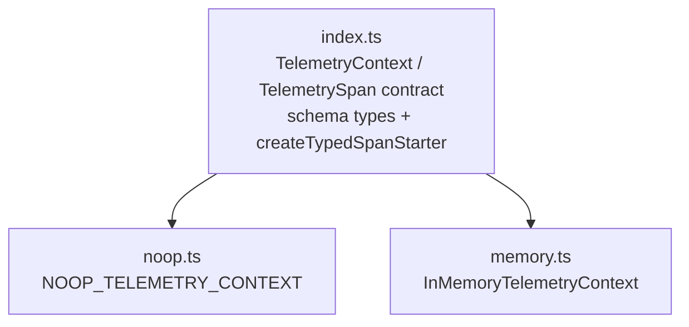

# reduced/telemetry — src overview

Standalone extraction of `packages/telemetry`. Three source files; two layers:
the contract + typed schema utilities (`index.ts`), and the two adapter
implementations (`noop.ts`, `memory.ts`).

## Layer 1: contract + typed schemas

1 file: index.ts

**`index.ts`** — the whole contract, plus compile-time schema tooling.
- Base contract:
  - `TelemetryContext.startSpan(options, callback)` — starts a span around a callback; the callback receives the span and the span is also the parent context for children
  - `TelemetrySpan` = context + `addEvent` / `setAttributes` / `setStatus`; no `end()` — settlement follows the callback's value or rejection
  - `SpanStatus` = ok, or error with optional `{ name, message }`
- Schema definitions (plain serializable data, no runtime behavior):
  - `defineTelemetrySchema` — typed identity helper; `TelemetrySchemaDefinition` = version + spans; each span declares `startAttributes` (with `required`), `endAttributes`, optional `events`, `parents`, `status`
  - `values` / `elementValues` on attribute definitions narrow the inferred TS type (e.g. `values: ["read", "write"]` infers `"read" | "write"`)
- Type inference layer (types only, no runtime cost):
  - `AttributeDefinitionValue` maps one attribute definition to its TS value type
  - `InferStartAttributes` / `InferEventAttributes` split required vs optional names
  - `ExactTelemetryAttributes` rejects excess properties on attribute literals
  - `SchemaTelemetrySpan` re-types `addEvent`/`setAttributes` to one span's declared vocabulary
- Typed starter:
  - `createTypedSpanStarter(context, schemas)` — runtime: just binds `context.startSpan`; compile-time: one overload per span name via `UnionToIntersection` of per-name signatures
  - the callback receives a child starter already bound to that span, so nesting stays typed
- Re-exports `InMemoryTelemetryContext` and `NOOP_TELEMETRY_CONTEXT`

## Layer 2: adapters

2 files: noop.ts, memory.ts

**`noop.ts`** — `NOOP_TELEMETRY_CONTEXT`, the do-nothing adapter.
- One shared frozen inert span; nested spans return the same span
- Callbacks run synchronously exactly once; sync throws convert to rejected promises

**`memory.ts`** — `InMemoryTelemetryContext`, the backend-neutral reference adapter.
- `startInMemorySpan`: create record (id from counter, parentId from parent) → build the `TelemetrySpan` facade → run callback
  - sync throw → settle with automatic error status, reject with same value
  - promise settlement → settle (ok, or error if rejected without explicit status)
- Recording methods are plain mutations: `addEvent` pushes, `setAttributes` merges (later defined values win), `setStatus` marks explicit status
- `settleSpan` stamps `settled` and a deterministic `endSequence` (order of completion, no timestamps)
- `getSpans()`: detached deep copies in span-start order — ids, parent ids, merged attributes, ordered events, final status

